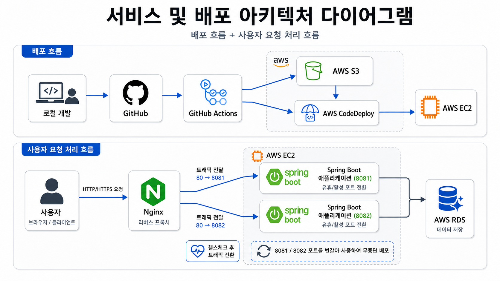
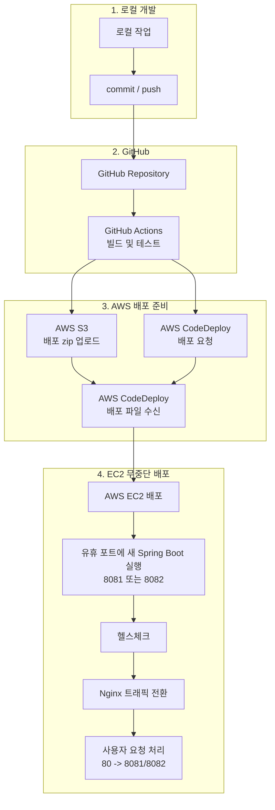

# freelec-webservice

AWS에서 Spring Boot 웹 서비스를 무중단 배포하는 방법을 학습하기 위한 프로젝트입니다.

게시글 CRUD와 OAuth2 로그인을 가진 Spring Boot 애플리케이션을 GitHub Actions, S3, CodeDeploy, EC2, Nginx를 이용해 배포합니다. EC2 내부에서는 애플리케이션을 `8081`, `8082` 포트에 번갈아 실행하고, 사용자는 Nginx가 열어 둔 `80` 포트로만 접근합니다.

## 서비스 및 배포 아키텍처

아래 다이어그램은 프로젝트의 배포 흐름과 사용자 요청 처리 흐름을 함께 나타냅니다.



## 배포 흐름



사용자는 항상 `http://EC2_PUBLIC_DNS` 로 요청합니다. Nginx는 내부적으로 현재 살아있는 Spring Boot 애플리케이션 포트인 `8081` 또는 `8082`로 요청을 전달합니다.

## 기술 스택

- Java 17
- Spring Boot 4.0.6
  - Spring MVC
  - Spring Data JPA
  - Spring Security OAuth2 Client
  - Spring Session JDBC
  - Mustache
  - Lombok
  - H2 Database (테스트)
- Gradle 9.4.1
- GitHub Actions
- AWS EC2
- AWS RDS MariaDB 11.8.6
- AWS S3
- AWS CodeDeploy
- Nginx 1.30.0

## 주요 기능

- 게시글 목록 조회
- 게시글 등록, 수정, 삭제
- Google OAuth2 로그인
- Naver OAuth2 로그인
- 로그인 사용자 세션 관리
- 실행 중인 Spring profile 확인 API
- `real1`, `real2` 프로파일 기반 무중단 배포
- Nginx 리버스 프록시를 통한 80 포트 서비스

## 프로젝트 구조

```text
.github/workflows
└── deploy.yml             # GitHub Actions 배포 워크플로

src
├── main
│   ├── java/com/example/freelecwebservice
│   │   ├── config          # JPA, Web MVC, Security 설정
│   │   ├── controller      # 화면/API 컨트롤러
│   │   ├── domain          # JPA 엔티티와 Repository
│   │   ├── dto             # 요청/응답 DTO
│   │   └── service         # 비즈니스 로직
│   └── resources
│       ├── static          # JavaScript 정적 파일
│       ├── templates       # Mustache 화면 템플릿
│       └── application*.properties
├── test
│   └── java/com/example/freelecwebservice

scripts
├── start.sh               # 유휴 포트에 새 애플리케이션 실행
├── stop.sh                # 유휴 포트의 기존 애플리케이션 종료
├── health.sh              # 새 애플리케이션 헬스체크
├── profile.sh             # 현재/유휴 profile과 port 계산
└── switch.sh              # Nginx upstream port 전환

appspec.yml                # CodeDeploy 배포 설정
```

## 데이터베이스 구조

운영 환경에서는 AWS RDS MariaDB를 사용합니다.  
게시글, 사용자, Spring Session JDBC에서 사용하는 세션 테이블 구조는 아래 DDL 파일에서 확인할 수 있습니다.

- [DB DDL SQL](docs/database/schema.sql)

> `SPRING_SESSION`, `SPRING_SESSION_ATTRIBUTES` 테이블은 Spring Session JDBC에서 세션 저장을 위해 사용하는 테이블입니다.

## AWS 배포 준비

### 1. AWS 리소스 준비

아래 리소스가 필요합니다.

- EC2 인스턴스: 학습 시 Amazon Linux 2023 사용
- S3 버킷: GitHub Actions가 배포 zip을 업로드할 위치
- CodeDeploy Application
- CodeDeploy Deployment Group
- EC2용 IAM Role
- GitHub Actions용 IAM User 또는 OIDC Role
- MariaDB 또는 호환 DB

보안 그룹은 최소한 아래 포트를 허용합니다.

| Port | 용도 | 접근 범위 |
| --- | --- | --- |
| 22 | SSH 접속 | 지정 IP|
| 80 | Nginx HTTP 요청 | 0.0.0.0/0|
| 8081 | Spring Boot real1 | EC2 내부 확인용|
| 8082 | Spring Boot real2 | EC2 내부 확인용|

운영에서는 `8081`, `8082`를 외부에 직접 열지 않고 EC2 내부 또는 제한된 대역에서만 접근하게 구성하는 것이 좋습니다.

### 2. GitHub Actions 설정

배포 워크플로는 `.github/workflows/deploy.yml`에 있습니다. `main` 브랜치에 push되면 아래 작업을 수행합니다.

1. 소스 체크아웃
2. JDK 17 설정
3. Gradle 빌드 및 테스트
4. JAR, `appspec.yml`, `scripts/*.sh`를 zip으로 패키징
5. S3 업로드
6. CodeDeploy 배포 요청

GitHub 저장소에는 아래 값을 설정해야 합니다. `Repositories Settings > Secrets and variables > Actions`

Repository Variables:

```text
S3_BUCKET : S3 버킷 이름
```

Repository Secrets:

```text
AWS_ACCESS_KEY_ID : AWS IAM 사용자 액세스 키
AWS_SECRET_ACCESS_KEY : AWS IAM 사용자 시크릿 키
```

실제 AWS Access Key, Secret Key, DB 비밀번호, OAuth Secret은 README나 Git 저장소에 포함하지 않습니다.

## EC2 설정 방법

아래 명령어는 Amazon Linux 2023 기준입니다.

### 1. 패키지 업데이트

```bash
sudo dnf update -y
```

### 2. Java 17 설치

```bash
sudo dnf install -y java-17-amazon-corretto
java -version
```

### 3. Nginx 설치 및 실행

```bash
sudo dnf install nginx -y
sudo systemctl start nginx
```

* start, stop, restart, status, enable

### 4. CodeDeploy Agent 설치

```bash
sudo dnf install ruby wget -y
cd /home/ec2-user
aws s3 cp s3://aws-codedeploy-ap-northeast-2/latest/install . --region ap-northeast-2
chmod +x ./install
sudo ./install auto
sudo systemctl status codedeploy-agent
sudo systemctl start codedeploy-agent
sudo systemctl enable codedeploy-agent
```

리전이 다르면 `ap-northeast-2` 부분을 사용하는 AWS 리전으로 변경합니다.

### 5. 배포 디렉터리 생성

```bash
sudo mkdir -p /home/ec2-user/app/step3/zip
sudo chown -R ec2-user:ec2-user /home/ec2-user/app
```

### 6. 외부 설정 파일 생성

민감 정보는 Git에 커밋하지 않고 EC2 내부 파일로 관리합니다.

```bash
vim /home/ec2-user/app/application-real-db.properties
```

```properties
spring.datasource.url=jdbc:mariadb://DB_HOST:PORT/DB_NAME?sslMode=TRUST
spring.datasource.username=DB_USERNAME
spring.datasource.password=DB_PASSWORD
spring.datasource.driver-class-name=org.mariadb.jdbc.Driver
```
* RDS 사용시 `DB_HOST` 는 RDS 엔드포인트를 넣어줍니다.
* RDS 파라미터 그룹에서 `require_secure_transport`가 `ON(True)`인 경우 **SSL/TLS 연결이 필요합니다.**
* MariaDB JDBC 사용 시 sslMode=TRUST를 추가하면 SSL 연결을 사용하되, 서버 인증서 검증은 엄격하게 수행하지 않습니다.

OAuth2 설정 파일도 EC2 내부에 둡니다.

```bash
vim /home/ec2-user/app/application-oauth2.properties
```

```properties
spring.security.oauth2.client.registration.google.client-id=GOOGLE_CLIENT_ID
spring.security.oauth2.client.registration.google.client-secret=GOOGLE_CLIENT_SECRET
spring.security.oauth2.client.registration.google.scope=profile,email

spring.security.oauth2.client.registration.naver.client-id=NAVER_CLIENT_ID
spring.security.oauth2.client.registration.naver.client-secret=NAVER_CLIENT_SECRET
spring.security.oauth2.client.registration.naver.redirect-uri={baseUrl}/{action}/oauth2/code/{registrationId}
spring.security.oauth2.client.registration.naver.authorization-grant-type=authorization_code
spring.security.oauth2.client.registration.naver.scope=name,email,profile_image
spring.security.oauth2.client.registration.naver.client-name=Naver

spring.security.oauth2.client.provider.naver.authorization-uri=https://nid.naver.com/oauth2.0/authorize
spring.security.oauth2.client.provider.naver.token-uri=https://nid.naver.com/oauth2.0/token
spring.security.oauth2.client.provider.naver.user-info-uri=https://openapi.naver.com/v1/nid/me
spring.security.oauth2.client.provider.naver.user-name-attribute=response
```

* Naver는 `CommonOAuth2Provider` 에서 기본 제공하지 않으므로 provider 설정을 직접 입력해야 합니다.

### 7. Nginx 리버스 프록시 설정

Nginx가 80 포트로 받은 요청을 현재 활성화된 Spring Boot 포트로 전달하도록 설정합니다.

```bash
sudo vim /etc/nginx/conf.d/service-url.inc
```

```nginx
set $service_url http://127.0.0.1:8081;
```

---

```bash
sudo vim /etc/nginx/nginx.conf
```

```nginx
http {
    ...
    server {
        ...
        include /etc/nginx/default.d/*.conf;
        include /etc/nginx/conf.d/service-url.inc;

        location / {
                proxy_pass $service_url;
                proxy_set_header X-Real-IP $remote_addr;
                proxy_set_header X-Forwarded-For $proxy_add_x_forwarded_for;
                proxy_set_header Host $http_host;
        }
    }
}
```

* 환경에 따라 server 블록은 /etc/nginx/nginx.conf 또는 /etc/nginx/conf.d/default.conf에 위치할 수 있습니다.

설정을 확인하고 Nginx를 다시 로드합니다.

```bash
sudo nginx -t
sudo systemctl reload nginx
```

배포가 진행되면 `scripts/switch.sh` 가 `/etc/nginx/conf.d/service-url.inc` 값을 `8081` 또는 `8082`로 바꾸고 Nginx를 reload합니다.

## 배포 실행

로컬에서 작업한 뒤 `main` 브랜치에 push합니다.

```bash
git add .
git commit -m "Feat: 배포 기능 수정"
git push origin main
```

이후 GitHub Actions가 자동으로 빌드, 테스트, S3 업로드, CodeDeploy 배포 요청을 수행합니다.

배포 상태는 AWS Console의 CodeDeploy 화면 또는 GitHub Actions 로그에서 확인합니다.

EC2에서 직접 상태를 확인하려면 아래 명령어를 사용할 수 있습니다.

stop.sh 실행 중 아래 오류가 발생할 수 있습니다.

```text
lsof: command not found
```
이 경우 lsof를 설치합니다.
```bash
sudo dnf install lsof -y
```

```bash
sudo systemctl status codedeploy-agent
curl http://localhost/profile
curl http://localhost:8081/profile
curl http://localhost:8082/profile
curl http://localhost
```

## 무중단 배포 동작 방식

이 프로젝트는 `real1`, `real2` 두 개의 운영 profile을 사용합니다.

| Profile | Port |
| --- | --- |
| `real1` | 8081 |
| `real2` | 8082 |

배포 순서는 다음과 같습니다.

1. 현재 Nginx가 바라보는 profile을 `/profile` API로 확인합니다.
2. 현재 사용 중이지 않은 profile을 유휴 profile로 판단합니다.
3. 유휴 profile의 포트에 새 JAR를 실행합니다.
4. 새 애플리케이션의 `/profile` API를 호출해 정상 실행 여부를 확인합니다.
5. 헬스체크가 성공하면 Nginx의 upstream 포트를 새 포트로 변경합니다.
6. Nginx를 reload하여 사용자 요청이 새 애플리케이션으로 전달되게 합니다.

이 방식은 기존 애플리케이션을 유지한 상태에서 새 애플리케이션을 먼저 띄운 뒤 트래픽을 전환하므로 배포 중 서비스 중단 시간을 줄일 수 있습니다.

## 주요 화면

- `/` : 게시글 목록
- `/posts/save` : 게시글 등록
- `/posts/update/{id}` : 게시글 수정
- `/oauth2/authorization/google` : Google 로그인
- `/oauth2/authorization/naver` : Naver 로그인
- `/logout` : 로그아웃

## API

| Method | URL | 설명 | 권한 |
| --- | --- | --- | --- |
| GET | `/hello` | 테스트 응답 | 공개 |
| GET | `/hello/dto?name={name}&amount={amount}` | DTO 응답 테스트 | 공개 |
| GET | `/profile` | 현재 실행 profile 조회 | 공개 |
| POST | `/api/v1/posts` | 게시글 등록 | USER |
| GET | `/api/v1/posts/{id}` | 게시글 단건 조회 | USER |
| PUT | `/api/v1/posts/{id}` | 게시글 수정 | USER |
| DELETE | `/api/v1/posts/{id}` | 게시글 삭제 | USER |

## 프로파일

| Profile | 용도 |
| --- | --- |
| `local` | 로컬 개발, H2 메모리 DB 사용 |
| `real` | 운영 공통 설정 |
| `real1` | 운영 배포용 8081 포트 |
| `real2` | 운영 배포용 8082 포트 |
| `oauth2` | OAuth2 클라이언트 설정 |
| `real-db` | 운영 DB 접속 설정 |

## 테스트

```bash
./gradlew test
```

테스트 환경은 `src/test/resources/application.properties` 설정과 H2 DB를 사용합니다.

## 주의 사항

- OAuth client id, client secret, DB 계정, DB 비밀번호는 README나 Git 저장소에 포함하지 않습니다.
- 운영 DB 설정과 OAuth 설정은 EC2 내부 파일 또는 안전한 외부 설정 저장소로 관리합니다.
- GitHub Actions Secret과 Repository Variable에는 실제 값만 등록하고 로그에 출력하지 않습니다.
- 운영 환경에서는 EC2 보안 그룹, IAM 권한, S3 버킷 접근 권한을 최소 권한으로 설정합니다.
